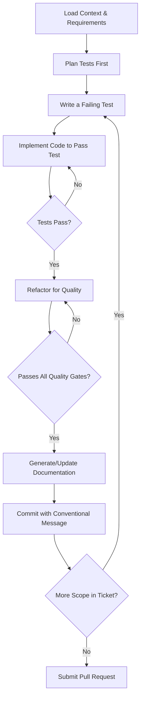

# brAInwav MAS – Agent Operational Instructions

## Purpose & Scope

This document provides explicit, actionable instructions for all AI agents operating within the **brAInwav Multi-Agent System (MAS)**. It translates the high-level policies from the brAInwav MAS – AI Governance Manual into concrete technical standards.

- For Task-Based Agents (e.g., OpenAI Codex): This is your primary operational guide.
- For Completion Assistants (e.g., GitHub Copilot): These are the standards your output must meet.
- For Human Developers: These standards apply to you, too.

In case of conflict, `RULES_OF_AI.md` is the supreme constitutional law, and the AI Governance Manual is the primary policy document.

---

## §1. Agent Operational Framework

### §1.1. Practical Application of Authority Levels

| Level       | Designation | Scope & Authority                                                                   | Examples                                                            |
| :---------- | :---------- | :---------------------------------------------------------------------------------- | :------------------------------------------------------------------ |
| ARCHITECT   | Review      | Read-only analysis of architecture, patterns, and performance. Cannot propose code. | Reviewing a PR for scalability, assessing a new pattern's validity. |
| ASSISTANT   | Execute     | Implement features, fix bugs, and refactor code within the approved scope.          | Implementing CRUD endpoints, fixing a bug described in an issue.    |
| CONTRIBUTOR | Suggest     | Generate inline code, tests, and documentation for human review and acceptance.     | Completing a line of code, suggesting a test case in the IDE.       |

> **WARNING**
> Any task requiring changes to security, API contracts (`/shared/contracts/api-schema.yaml`), core architecture, or project scope MUST be flagged for human review.

### §1.2. Test-Driven Workflow

All agents with an ASSISTANT authority level MUST follow this TDD workflow.



---

## §2. Code Implementation Standards

### §2.1. Provider Abstraction Pattern

All provider-facing code MUST be abstracted in `/apps/api/src/providers/` to prevent vendor lock-in. Core business logic in `/apps/api/src/services/` MUST be provider-agnostic.

```python
# CORRECT – The Service module uses a generic interface.
from apps.api.src.providers.base import AIProvider

class ClassifierService:
    def __init__(self, provider: AIProvider):
        self.provider = provider

    async def classify(self, content: str) -> Classification:
        # Core logic is provider-agnostic.
        prompt = self._build_prompt(content)
        result = await self.provider.complete(prompt)
        return self._parse_result(result)
```

### §2.2. Structured Error Handling

Use specific, custom exceptions. Do not swallow errors or use broad `except Exception:`. This aligns with our "Ethical AI Automation" pillar by ensuring transparent failure modes.

```python
# CORRECT pattern:
try:
    result = await some_io_operation()
    return result
except TransientError as e:
    logger.warning("Operation failed, will retry", error=str(e))
    # Logic for retry with backoff...
except PermanentError as e:
    logger.error("Operation failed permanently", error=str(e), exc_info=True)
    raise OperationFailedError(f"Cannot complete operation: {str(e)}") from e
```

### §2.3. Testing Pattern

Use `pytest` fixtures and mock all external services at the provider boundary.

```python
# CORRECT testing pattern:
@pytest.mark.asyncio
async def test_classifier_service_with_mock_provider(mocker):
    # Arrange: Mock the provider interface.
    mock_provider = mocker.AsyncMock(spec=AIProvider)
    mock_provider.complete.return_value = {"category": "Projects", "confidence": 0.95}
    classifier_service = ClassifierService(provider=mock_provider)

    # Act
    result = await classifier_service.classify("Test content")

    # Assert
    assert result.category == "Projects"
    mock_provider.complete.assert_called_once()
```

---

## §3. Version Control & Audit Trail

### §3.1. Branch Naming

Branches MUST be named `type/<issue-id>-<description>`.

**Examples:** `feat/BRAIN-123-classifier-service`, `fix/BRAIN-456-null-pointer-exception`

### §3.2. Commit & Audit Log Requirements

All commits MUST follow the Conventional Commits specification. Furthermore, the CI/CD pipeline enforces two audit trail requirements:

- **Commit Footer:** The commit message footer MUST tag the primary AI agent used.
- **Citation Log:** The `AI_CONTRIB_LOG.yaml` file MUST be updated with verifiable citations for all changes, as mandated by the Governance Manual.

**Example Commit Message:**

```text
feat(services): add confidence scoring to classifier

Implements a confidence score based on the provider's output,
allowing the system to route low-confidence items for human review.
This fulfills requirements in ticket BRAIN-123.

[ai-assisted: openai_codex_platform]
```

---

## §4. Quality Assurance Script

The `scripts/validate_pr.sh` script is the primary enforcement mechanism for these standards and MUST pass before merging.

```bash
#!/bin/bash
# Pre-merge quality gate validation script.
set -e

echo " brAInwav Quality Gates"
echo "========================"

echo "🧹 Running formatters and linters on backend..."
black --check apps/api/src/ apps/api/tests/
ruff check apps/api/src/ apps/api/tests/
isort --check-only --profile black apps/api/src/ apps/api/tests/

echo "🔍 Running type checker on backend..."
mypy --strict apps/api/src

echo "🧪 Running tests and coverage for backend..."
export PYTHONPATH=".:$PYTHONPATH"
pytest apps/api/tests/ --cov=apps/api/src --cov-fail-under=90

echo "✅ All quality gates passed."
```

---

## §5. Definition of Done (PR Checklist)

A PR is only complete when it meets these criteria. Use this as a checklist in your PR description.

- [ ] **Constitution:** All work adheres to `/RULES_OF_AI.md`.
- [ ] **Scope:** Implementation exactly matches the linked GitHub Issue.
- [ ] **Testing:** All code is fully tested according to TDD, and coverage is ≥90%.
- [ ] **Quality Gates:** The `/scripts/validate_pr.sh` script passes successfully.
- [ ] **Audit Trail:** The commit message is correct, and `AI_CONTRIB_LOG.yaml` is updated.
- [ ] **Documentation:** All public code is documented, and relevant `/docs` files are updated.
- [ ] **Security:** No secrets are present in code.
- [ ] **Accessibility:** (If applicable) UI changes meet WCAG 2.1 AA standards.
