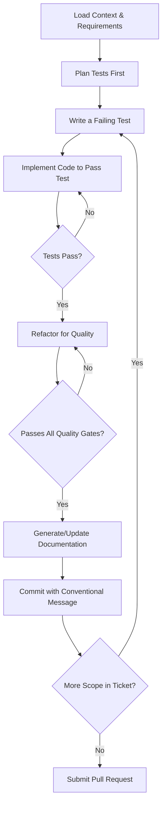

# **brAInwav Generic Code Generation Instructions**

**Applies to:** GitHub Copilot, OpenAI Codex, Claude, Gemini, Google Jules, and all other code-generation agents.
**Purpose:** To provide explicit, actionable instructions for code generation, ensuring all contributions adhere to project standards.
**Authority:** The supreme law is defined in `/.ai/RULES_OF_AI.md`. This document is the primary implementation guide for that constitution. In case of conflict, `RULES_OF_AI.md` always wins.

---

## §1. Agent Operational Framework

### §1.1 Authority Levels

| Level | Designation | Scope & Authority | Examples |
|-------|-------------|-------------------|----------|
| 🟢 | **Full Autonomy** | Code, tests, and docs within the approved feature scope. | Implementing CRUD endpoints, fixing bugs, refactoring a single module. |
| 🟡 | **Guided Autonomy** | Minor architectural changes or new dependencies that are documented in the PR. | Adding a utility library, applying a new pattern across several files. |
| 🔴 | **STOP & Escalate** | Any change to security, API contracts, core architecture, or project scope. | Changing authentication, altering `api-schema.yaml`, adding a new provider. |

### §1.2 Test-Driven Workflow

All agents MUST follow this TDD workflow.



---

## §2. Core Requirements (Implementation of the Constitution)

This section translates the **what** from `/.ai/RULES_OF_AI.md` into the **how** for code generation.

* **Scope Adherence:** Implement **only** the work defined in the linked GitHub Issue and `docs/feature_plan.md`. Reference **§1** of the constitution.
* **Architectural Integrity:** All generated code MUST conform to the structure defined in `docs/PROJECT_STRUCTURE.md` and the patterns in this document. Reference **§2** of the constitution.
* **Security & Secrets:** All code MUST handle secrets exclusively via the 1Password CLI. No secrets in code, tests, or logs. Reference **§3** of the constitution.
* **Testing & Quality:** All code MUST meet the TDD and coverage standards (≥90%). Reference **§4** of the constitution.
* **Documentation:** All public functions and classes MUST have comprehensive docstrings. All significant decisions MUST be logged in `docs/adr/`. Reference **§6** of the constitution.
* **Accessibility:** All UI components MUST meet WCAG 2.1 AA standards. Reference **§7** of the constitution.

---

## §3. Code Implementation Standards

### §3.1 Provider Abstraction Pattern

All provider-facing code MUST be abstracted to prevent lock-in.

```python
# CORRECT - The Core module uses a generic interface.
from backend.src.integrations.providers.base import AIProvider

class ClassifierAgent:
    def __init__(self, provider: AIProvider):
        self.provider = provider

    async def classify(self, content: str) -> Classification:
        # Core logic is provider-agnostic.
        prompt = self._build_prompt(content)
        result = await self.provider.complete(prompt)
        return self._parse_result(result)

# INCORRECT - The Core module imports a specific provider.
from backend.src.integrations.providers.openai import OpenAIProvider # <-- VIOLATION

class ClassifierAgent:
    def __init__(self):
        # Logic is tightly coupled to a specific provider.
        self.provider = OpenAIProvider()
```

### §3.2 Error Handling Pattern

Use specific, structured error handling. Do not swallow errors or use broad exceptions.

```python
# CORRECT pattern:
try:
    result = await some_io_operation()
    return result
except TransientError as e:
    logger.warning("Operation failed, will retry", error=str(e))
    # Logic for retry with backoff...
except PermanentError as e:
    logger.error("Operation failed permanently", error=str(e))
    raise OperationFailed(f"Cannot complete operation: {str(e)}")

# INCORRECT pattern:
try:
    # code
except Exception as e:  # <-- VIOLATION: Exception is too broad.
    print(f"Error: {e}")  # <-- VIOLATION: Log is not structured.
    pass  # <-- VIOLATION: Swallowing error silently.
```

### §3.3 Testing Pattern

Use `pytest` fixtures and mock all external services.

```python
# CORRECT testing pattern:
@pytest.mark.asyncio
async def test_classifier_with_mock_provider(mocker):
    # Arrange: Mock the provider interface.
    mock_provider = mocker.AsyncMock(spec=AIProvider)
    mock_provider.complete.return_value = {"category": "Projects", "confidence": 0.95}
    classifier = ClassifierAgent(provider=mock_provider)

    # Act
    result = await classifier.classify("Test content")

    # Assert
    assert result.category == "Projects"
    mock_provider.complete.assert_called_once()
```

---

## §4. Version Control & Committing

### §4.1 Branch Naming

Branches MUST be named `type/<issue-id>-<description>`, linking them to a work item.

* **Examples:** `feat/BRAIN-123-classifier`, `fix/BRAIN-456-handle-nulls`

### §4.2 Conventional Commits

All commit messages MUST follow the Conventional Commits specification. Additionally, tag AI-assisted commits in the footer.

**Example Commit Message:**

```text
feat(agents): add confidence scoring to classifier

Implements a confidence score based on the provider's output,
allowing the system to route low-confidence items for review.
This fulfills requirements in ticket BRAIN-123.

[ai-assisted: github-copilot]
```

---

## §5. Quality Assurance Script

The following script, located at `scripts/validate_pr.sh`, is run by CI and MUST pass before merging. Run it locally before submitting a PR.

```bash
#!/bin/bash
# Pre-merge quality gate validation script.
set -e

echo " brAInwav Quality Gates"
echo "========================"

echo "🧹 Running formatters and linters on backend..."
black --check backend/src/ backend/tests/
ruff check backend/src/ backend/tests/
isort --check-only --profile black backend/src/ backend/tests/

echo "🔍 Running type checker on backend..."
mypy --strict backend/src/

echo "🧪 Running tests and coverage for backend..."
pytest backend/ --cov=backend/src --cov-fail-under=90 --cov-report=xml:reports/coverage.xml

echo "🏗️ Validating architectural boundaries..."
if find backend/src/features/ -name "*provider*" -type f | grep -q .; then
  echo "❌ ARCHITECTURE VIOLATION: Provider-specific logic found in core feature directory."
  exit 1
fi

echo "✅ All quality gates passed."
```

---

## §6. Definition of Done (PR Checklist)

A PR is only complete when it meets these criteria. Use this as a checklist in your PR description.

* [ ] **Constitution:** All work adheres to `/.ai/RULES_OF_AI.md`.
* [ ] **Scope:** Feature implementation exactly matches the linked GitHub Issue.
* [ ] **Testing:** All code is fully tested according to TDD, and coverage is ≥90%.
* [ ] **Quality Gates:** The `scripts/validate_pr.sh` script passes successfully.
* [ ] **Documentation:** All public code is documented with docstrings, and relevant guides/ADRs in `/docs` are updated.
* [ ] **Security:** No secrets are present in code, and all operations are secure.
* [- ] **Accessibility:** (If applicable) UI changes meet WCAG 2.1 AA standards and include validation evidence.

---

> **This document is machine-first configuration.** All code generation agents must operate within these parameters. If in doubt, **STOP** and escalate per **§8** of the constitution.
