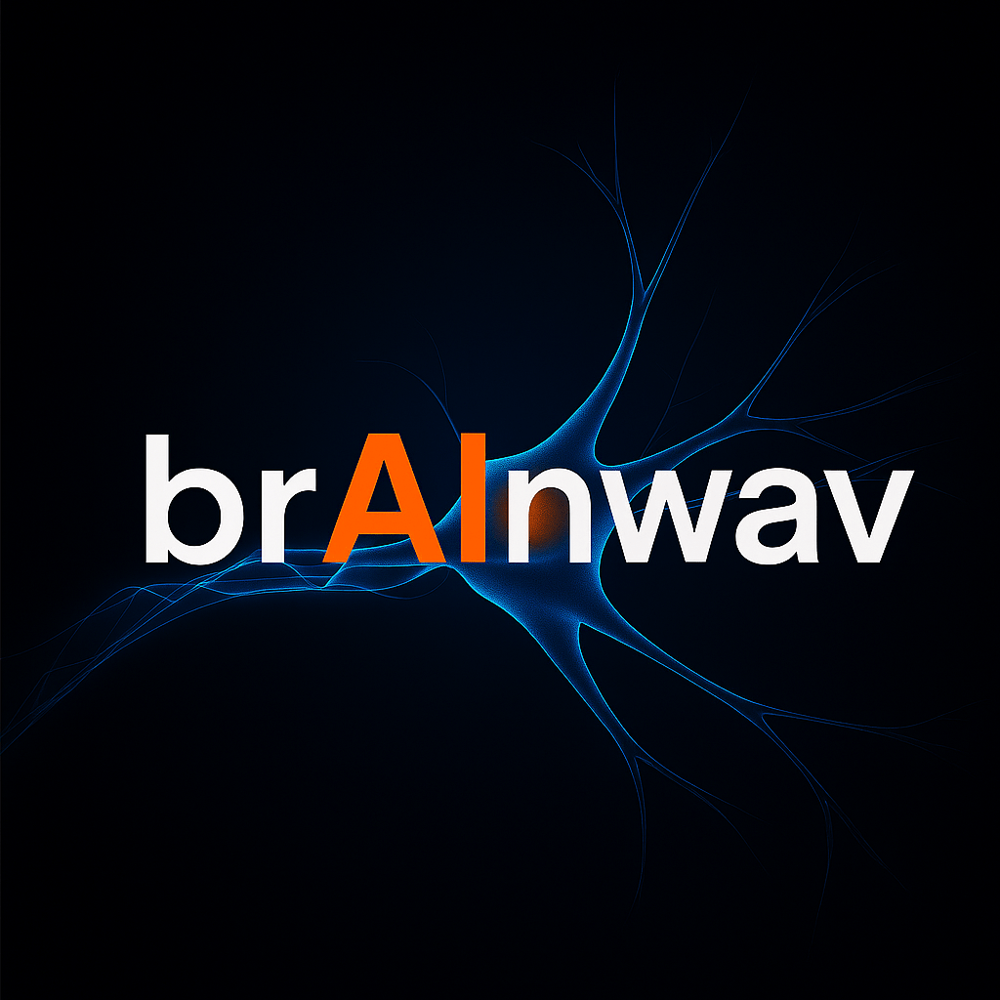

# AI Leadership Engineering Roadmap

```html

```

## A 34-Week, Self-Directed Journey to Master the Skills of a Modern AI Architect and Product Leader

> "The future belongs to those who can navigate the intersection of artificial intelligence, human insight, and ethical responsibility."

[](https://github.com/jamiescottcraik/ai-engineering-roadmap)
[](https://jamiescottcraik.github.io/ai-engineering-roadmap/)
[](https://github.com/jamiescottcraik/ai-engineering-roadmap/blob/main/frontend/public/roadmap.json)
[](https://github.com/jamiescottcraik/ai-engineering-roadmap#project-focus)

// cSpell:ignore architecting deeplearning Kleppmann Aurélien Géron Forsgren

---

## 🎯 Mission

Transforming from technical foundations to AI leadership through structured learning, hands-on projects, and measurable deliverables. This roadmap represents a comprehensive pathway from advanced programming to architecting ethical AI systems and leading product teams.

## 🗺️ Interactive Roadmap



**[📄 View Mermaid Source](docs/roadmap.mmd) | [🖼️ SVG Version](docs/roadmap.svg)**

**[🚀 VIEW FULL INTERACTIVE ROADMAP](https://jamiescottcraik.github.io/ai-engineering-roadmap/)**

### ✨ New Enhanced Features

- **📚 Direct Resource Access**: Every node displays learning resources with direct links
- **🎯 Vertical roadmap.sh-style Layout**: Step-by-step progression with visual connectors
- **⚡ Real-time Progress Tracking**: Time-based progress calculations from start date
- **🎨 Modern UX Design**: Hover effects, progress circles, and status indicators
- **📱 Mobile Responsive**: Optimized for all device sizes
- **🔗 Resource Type Icons**: Visual indicators for courses, books, tutorials, and more
- **🏁 Checkpoint System**: Clear milestones and deliverable tracking
- **💡 Learning Rationale**: "Why this matters" context for each milestone
- **🦙 Ollama Integration**: Status card and evening assistant components for local model interaction

Explore the complete roadmap with progress tracking, detailed descriptions, and milestone checkpoints

---

## 📊 Current Status

**🚀 Current Phase:** 1 - Advanced Technical Foundations  
**🎯 Current Focus:** Environment setup and Python fundamentals  
**📅 Week:** 1 of 34  
**🏆 Next Deliverable:** GitHub Stats Generator (target: July 5, 2025)  
**⏰ Start Date:** June 22, 2025

### This Week's Progress

- ✅ Comprehensive roadmap architecture and planning
- ✅ Development environment setup and toolchain
- ✅ Repository structure and professional documentation
- 🔄 Python 3 Programming Specialization enrollment
- ⏳ Mathematical foundations research and planning

[📈 View Detailed Progress](progress/README.md) | [📝 Latest Weekly Review](progress/weekly-reviews/week-01-review.md)

---

## 🏗️ The 5-Phase Architecture

### Phase 1: Core Engineering Foundations (8 weeks)

#### Master Professional Development Practices

- Advanced Python & Mathematical Foundations
- Complex SQL & Database Design
- CI/CD Pipelines & DevOps Excellence
- **🏆 Deliverable:** Production Data Analysis API

### Phase 2: Build & Deploy Production AI (10 weeks)

#### Applied AI & MLOps Mastery

- Advanced RAG Systems & Evaluation
- Multi-Agent Orchestration
- MLOps & Containerized Deployments
- **🏆 Deliverable:** Live AI Services with 99.9% Uptime

### Phase 3: Architect for Scale & Safety (8 weeks)

#### System Architecture & AI Safety

- Study "Designing Data-Intensive Applications"
- AI System Design Patterns
- Ethical AI & Safety Frameworks
- **🏆 Deliverable:** P.A.R.A.gon AI Technical Blueprint

### Phase 4: Lead Product & People (10 weeks)

#### Strategy & Leadership Development

- UX & Product Discovery for AI
- Enterprise AI Strategy
- Community Leadership & Mentorship
- **🏆 Deliverable:** AI Mentorship Program

### Phase 5: Launch & Establish Influence (12 weeks)

#### Synthesis & Public Impact

- Product Launch & User Acquisition
- Open Source Contributions
- Thought Leadership & Public Speaking
- **🏆 Deliverable:** P.A.R.A.gon AI v1.0 with 500+ Users

---

## 🎖️ From Military Leadership to AI Innovation

This journey builds on a foundation of military leadership experience, translating strategic thinking, systematic execution, and ethical responsibility into the rapidly evolving field of artificial intelligence. Every phase is designed to bridge technical excellence with leadership capability.

---

**Ready to transform the future of AI?**

[🚀 Start Your Journey](https://jamiescottcraik.github.io/ai-engineering-roadmap/) | [📚 View Documentation](docs/) | [🤝 Join the Community](https://github.com/jamiescottcraik/ai-engineering-roadmap/discussions)

---

**Last Updated:** June 22, 2025 &nbsp;|&nbsp; **Next Update:** June 29, 2025

## 📊 Repository Structure

```bash
ai-engineering-roadmap/
├── 📁 data/                    # Roadmap data and configurations
├── 📁 docs/                    # Documentation and resources
├── 📁 frontend/                # Interactive roadmap interface
├── 📁 progress/                # Weekly reviews and tracking
├── 📁 projects/                # Portfolio project code
├── 📁 scripts/                 # Automation and CI/CD
└── 📄 README.md               # This comprehensive overview
```

---

## 🚀 Featured Portfolio Projects

### 🛡️ Ethical AI Guardian

#### Ensuring AI systems are safe, fair, and trustworthy - a critical requirement for enterprise adoption

**Impact:** Automated bias detection and compliance frameworks for production AI systems

- Real-time bias monitoring and mitigation
- Compliance automation for enterprise requirements
- Open-source components for community benefit

### 🧠 Cognitive Load Reducer

#### Directly addressing information overload to make knowledge accessible to everyone

**Impact:** AI-powered system that intelligently summarizes and contextualizes information

- Sub-2-second response times for complex queries
- Multi-modal document processing capabilities
- 90%+ user satisfaction in cognitive load reduction

### 📊 Data Analysis API

#### Production-ready foundation for data-driven decision making

**Impact:** Scalable API with comprehensive CI/CD and monitoring

- 99%+ uptime with automated deployment
- 95%+ test coverage with quality gates
- Real-time analytics and performance monitoring

---

## 🎯 Project Focus: P.A.R.A.gon AI

### Personal AI Research Assistant & Goal-oriented Navigator

A comprehensive AI system that helps users organize knowledge, discover learning paths, and achieve goals through intelligent assistance. This project serves as the central thread connecting all phases of the roadmap.

### Key Features

- 🧠 Multi-modal knowledge processing and organization
- 🎓 Personalized learning path recommendation
- 🎯 Goal tracking and achievement optimization
- 🤝 Collaborative research assistance
- 🛡️ Ethical AI with built-in safety guardrails

### Development Timeline

- **Phase 1-2:** Core AI components (RAG, agents, deployment)
- **Phase 3:** Architecture design and safety frameworks
- **Phase 4:** Product strategy and user experience
- **Phase 5:** Launch and market establishment

---

## 📚 Learning Resources

### Current Course Stack

- **Mathematics:** Linear Algebra & Calculus for ML
- **Programming:** Advanced Python Patterns & Algorithms
- **AI/ML:** Deep Learning Specialization (deeplearning.ai)
- **Systems:** Designing Data-Intensive Applications
- **Leadership:** AI Product Management & Strategy

### Key Books

- 📖 "Designing Data-Intensive Applications" by Martin Kleppmann
- 📖 "Hands-On Machine Learning" by Aurélien Géron
- 📖 "The Design of Everyday Things" by Don Norman
- 📖 "Accelerate" by Nicole Forsgren, Jez Humble, Gene Kim

---

## 🏆 Milestones & Checkpoints

| Checkpoint | Deliverable | Target Date | Status |
|------------|-------------|-------------|---------|
| **Python Fundamentals** | GitHub Stats Generator | July 5, 2025 | ⏳ Planned |
| **Professional Engineering** | Data Analysis API | August 16, 2025 | ⏳ Planned |
| **Production AI** | Cognitive Load Reducer | October 25, 2025 | ⏳ Planned |
| **AI Architecture** | Ethical AI Guardian | December 20, 2025 | ⏳ Planned |
| **Product Leadership** | P.A.R.A.gon AI Strategy | February 14, 2026 | ⏳ Planned |
| **Industry Recognition** | P.A.R.A.gon AI v1.0 Launch | March 15, 2026 | ⏳ Planned |

---

## 📈 Weekly Progress Tracking

This roadmap is a living document that evolves with real progress and insights:

### Recent Updates

- **Week 1:** Roadmap launch, environment setup, planning phase
- **June 22:** Official start date and repository launch  
- **Planning:** GitHub Stats Generator mini-project design
- **Next:** Python 3 Programming Specialization begins

[📊 View All Weekly Reviews](progress/weekly-reviews/) | [📈 Progress Analytics](progress/analytics.md)

---

## 🤝 Community & Collaboration

### How to Contribute to This Roadmap

We welcome contributions to make this roadmap even better! Here's how you can help:

#### 🛠️ Roadmap Improvements

- **Resource Suggestions**: Know a great course, book, or tutorial? [Open an issue](https://github.com/jamiescottcraik/ai-engineering-roadmap/issues/new?template=resource-suggestion.md) with the resource details
- **Learning Path Feedback**: Found a better sequence or missing milestone? [Share your insights](https://github.com/jamiescottcraik/ai-engineering-roadmap/discussions)
- **Technical Corrections**: Spot an error or outdated information? [Submit a pull request](https://github.com/jamiescottcraik/ai-engineering-roadmap/pulls)

#### 💡 Feature Requests

- **UX Enhancements**: Ideas for improving the interactive roadmap? [Create a feature request](https://github.com/jamiescottcraik/ai-engineering-roadmap/issues/new?template=feature-request.md)
- **Data Visualization**: Suggestions for better progress tracking or visualization? We'd love to hear from you!

#### 🎯 Content Contributions

- **Phase Expertise**: Expert in ML, cloud architecture, or AI ethics? Help improve specific phases
- **Industry Insights**: Share real-world perspectives on AI engineering roles and requirements
- **Learning Resources**: Curate and review learning materials for quality and relevance

#### 📝 Documentation

- **Tutorials**: Write guides for complex topics or tools
- **Best Practices**: Share patterns and approaches that work in production
- **Case Studies**: Document real implementation examples and lessons learned

#### 🚀 Getting Started with Contributions

1. **Fork this repository** and create a feature branch
2. **Review the [CONTRIBUTING.md](CONTRIBUTING.md)** for detailed guidelines
3. **Test your changes** using the local development setup
4. **Submit a pull request** with a clear description of your changes
5. **Engage in code review** and iterate based on feedback

### Community Guidelines

- 🎯 **Stay Focused**: Contributions should align with AI engineering and leadership development
- 🤝 **Be Collaborative**: Respectful discussion leads to better outcomes
- 📚 **Evidence-Based**: Support suggestions with rationale and sources when possible
- 🔄 **Iterative Improvement**: Small, focused contributions are preferred over large changes

### Get Involved

- **Follow the Journey:** Star this repository for updates
- **Share Insights:** Open issues for suggestions and discussions
- **Collaborate:** Fork and adapt this roadmap for your journey

### Connect

- 🔗 [LinkedIn](https://linkedin.com/in/jamiescottcraik)
- 🐦 [Twitter](https://twitter.com/jamiescottcraik)
- 💼 [Portfolio](https://jamiescottcraik.dev)

---
